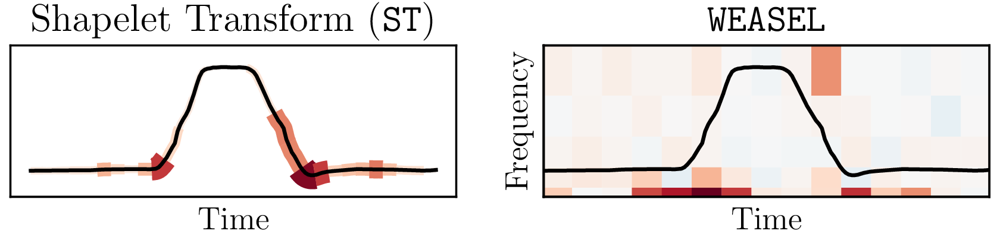

# timeXplain

This is the Python reference implementation of our paper
"[timeXplain – A Framework for Explaining the Predictions of Time Series Classifiers](https://arxiv.org/abs/2007.07606)".

Modern time series classifiers display impressive predictive capabilities, yet
their decision-making processes mostly remain black boxes to the user. At the
same time, model-agnostic explainers, such as the recently proposed *SHAP*,
promise to make the predictions of machine learning models interpretable,
provided there are well-designed domain mappings. We bring both worlds together
in our *timeXplain* framework, extending the reach of explainable artificial
intelligence to time series classification and value prediction. We present
novel domain mappings for the time domain, frequency domain, and time series
statistics and analyze their explicative power as well as their limits. We
employ a novel evaluation metric to experimentally compare *timeXplain* to
several model-specific explanation approaches for state-of-the-art time series
classifiers.

Please cite our paper if you refer to our results or use the method or code in
your own work:

    @article{mujkanovic2020timexplain,
        title={timeXplain -- A Framework for Explaining the Predictions of Time Series Classifiers},
        author={Mujkanovic, Felix and Dosko\v{c}, Vanja and Schirneck, Martin and Sch\"afer, Patrick and Friedrich, Tobias},
        journal={arXiv preprint arXiv:2007.07606},
        year={2020}
    }

## Quick Start

To get started with timeXplain, take a look at the notebooks in
`experiments/notebooks/`:

* The notebook [`case_study.ipynb`](experiments/notebooks/case_study.ipynb)
  reproduces the small case study presented above and thereby introduces how to
  use the package.
* The notebook [`explainers.ipynb`](experiments/notebooks/explainers.ipynb)
  showcases all explanation methods offered by the package, including both
  model-agnostic and model-specific techniques.

## Setup

For the library itself, install the dependencies listed in
[`requirements.txt`](requirements.txt). In addition, there are two optional
dependencies:

- `numba` is only used by a tiny portion of the library, which will warn you at
  runtime if the package is missing.
- `scikit-learn` is only used at one point in the library, which will throw an
  error if the package is missing.

If you want to run the notebooks or reproduce the evaluation experiment, you
additionally need to install the dependencies listed in
[`requirements-experiments.txt`](requirements-experiments.txt).

## Libraries Supported by the Model-Specific Explainers

The model-specific explainers (which are not to be confused with the
model-agnostic explainers) were implemented to be compatible with the following
libraries:

- [`LinearShapExplainer` and `TreeShapExplainer`](timexplain/spec/_shap.py)
  support `sktime`'s rotation trees and libraries that `shap` itself supports.
- [`ShapeletTransformExplainer`](timexplain/spec/_shapelet.py)
  supports `sktime`.
- [`SaxVsmWordSuperposExplainer` and `WeaselExplainer`](timexplain/spec/_bop.py)
  support `pyts`.
- [`NeuralCamExplainer`](timexplain/spec/_neural.py)
  supports `keras`.

If needed, adapting the model-specific explainers to other libraries should not
be too difficult.

## Reproducing the Evaluation Experiment

To reproduce the entire evaluation experiment from the paper, first download the
[2018 UCR Time Series Classification Archive](https://www.cs.ucr.edu/%7Eeamonn/time_series_data_2018/)
and extract it into the `experiments/data/ucr/` folder, mimicking the FaceFour
and GunPoint time series which are already there. Then delete all time series
except the following ones:

    ArrowHead
    BeetleFly
    BirdChicken
    BME
    Car
    CBF
    Chinatown
    ChlorineConcentration
    CinCECGTorso
    Coffee
    Computers
    DiatomSizeReduction
    DistalPhalanxOutlineAgeGroup
    DistalPhalanxOutlineCorrect
    DistalPhalanxTW
    Earthquakes
    ECG200
    ECGFiveDays
    EthanolLevel
    FaceFour
    FordA
    FordB
    FreezerRegularTrain
    FreezerSmallTrain
    GunPoint
    Ham
    HandOutlines
    Herring
    HouseTwenty
    ItalyPowerDemand
    LargeKitchenAppliances
    Lightning2
    Meat
    MelbournePedestrian
    MiddlePhalanxOutlineAgeGroup
    MiddlePhalanxOutlineCorrect
    MoteStrain
    OliveOil
    PhalangesOutlinesCorrect
    ProximalPhalanxOutlineAgeGroup
    ProximalPhalanxOutlineCorrect
    RefrigerationDevices
    Rock
    ScreenType
    ShapeletSim
    SmallKitchenAppliances
    SmoothSubspace
    SonyAIBORobotSurface1
    SonyAIBORobotSurface2
    StarLightCurves
    Strawberry
    ToeSegmentation1
    ToeSegmentation2
    Trace
    TwoLeadECG
    TwoPatterns
    UMD
    Wafer
    Wine
    WormsTwoClass
    Yoga

Next, execute this command in the root directory of the repository to fit all
classifiers:

    $ python experun.py classifier_fitter -p <PROCESSES> -a ucr -c \
          time_series_forest \
          shapelet_transform \
          sax_vsm weasel \
          rotation_forest \
          svm_linear \
          resnet

Now execute the following command to compute impacts explaining the predictions
of the fitted classifiers:

    $ python experun.py impacts -p <PROCESSES> -a ucr -e \
          shap_timeslice_local_mean \
          shap_timeslice_local_mean_bgcs \
          shap_timeslice_global_mean \
          shap_timeslice_global_mean_bgcs \
          shap_timeslice_local_noise \
          shap_timeslice_local_noise_bgcs \
          shap_timeslice_global_noise \
          shap_timeslice_global_noise_bgcs \
          shap_timeslice_sample \
          shap_timeslice_sample_bgcs \
          shapelet_superpos \
          shapelet_superpos_divide_spread \
          sax_vsm_word_superpos \
          sax_vsm_word_superpos_divide_spread \
          weasel_word_superpos \
          weasel_word_superpos_divide_spread \
          tree_shap \
          neural_cam \
          -s 5

Next, execute the following command to compute the fidelity and informativeness
scores from the computed impacts:

    $ python experun.py evaluation_data -p <PROCESSES> -a ucr

Finally, collect fidelity and informativeness scores by executing this command:

    $ python experun.py evaluation_metrics

As the last step, run the
[`evaluation_metrics.ipynb`](experiments/notebooks/evaluation_metrics.ipynb)
notebook to reproduce our mean fidelity and mean informativeness plots from the
aggregated results.
